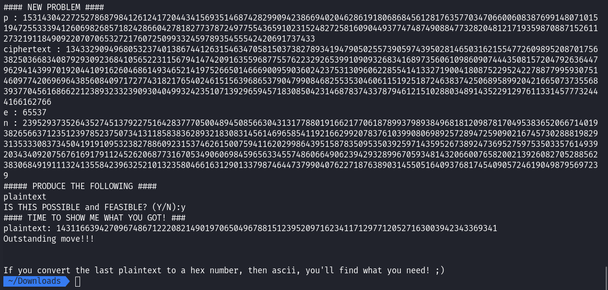

# Cryptography

## The Numbers - 50 Points

The numbers given to us are the values of letters within in the alphabet. 

We can use [this website](https://www.dcode.fr/letter-number-cipher) to quickly decode to the numbers.

16 9 3 15 3 20 6 { 20 8 5 14 21 13 2 5 18 19 13 1 19 15 14 }


The flag for this challenge is `PICOCTF{THENUMBERSMASON}`

## caesar - 100 Points

In this challenge, we are given ciphertext with a caesar cipher encoded string. 


Take the contents within the curly braces, and put it into [this website](https://www.dcode.fr/caesar-cipher) to decode the string. Brute force the shift until the text becomes legible (the shift should be 22).


The flag for this challenge is `picoCTF{crossingtherubiconvfhsjkou}`

## Easy1 - 100 Points

In this challenge, we are told to decrypt a one time pad cipher encoded string.

We are given: the ciphertext `UFJKXQZQUNB`, the key `SOLVECRYPTO`, and the table.  

You can either solve this simply by putting these elements into [this website](https://www.boxentriq.com/code-breaking/one-time-pad), or do it the more *fun* way, which is to manually decode it. 

In order to decrypt the message, we have to work backwards. To derive a cleartext value from a ciphertext letter, you need to choose the row that corresponds with the first letter of the key. Then within that row, find the letter of the ciphertext. Once found, highlight the column and see which letter it corresponds to; that letter should be the first letter of the cleartext. Keep repeating these steps with every letter in the ciphertext, in relation with every letter in the key.  


The flag for this challenge is `picoCTF{CRYPTOISFUN}`

## 13 - 100 Points

In this challenge, we are given ciphertext encoded using ROT13. To decode this, you can use [this website](https://rot13.com/) to quickly decode it, or do it manually by using the same logic as the caesar cipher, with the shift being 13. 

The flag for this challenge is `picoCTF{not_too_bad_of_a_problem}`

## rsa-pop-quiz - 200 Points

In this challenge, we connect to the given socket using Netcat and be presented some questions. To answer these questions, we need to visit the given [RSA Wikipedia page](https://simple.wikipedia.org/wiki/RSA_algorithm), and jot down some useful equations. 

For the first few questions, we will need to know how to calculate the modulus for the public and private keys:


Knowing this, we can answer the first two questions. For the first question, you need to get the product of the given *p* and *q*. 


For the second question, we need to get the quotient of *n* over *p*. 


The third question asks us to solve for both *p* and *q* given *e* and *n*. This is pretty much impossible to do, so just enter `N` and move onto the next question.

The fourth question requires a new formula for us to use. Here, we have to solve for totient(*n*) given *p* and *q*. To do this, we need to use formula:


The fifth question requires another new formula, one used to encrypt plaintext into ciphertext. For this, we can use:


where:

*m* = 6357294171489311547190987615544575133581967886499484091352661406414044440475205342882841236357665973431462491355089413710392273380203038793241564304774271529108729717

*e* = 3

*n* = 29129463609326322559521123136222078780585451208149138547799121083622333250646678767769126248182207478527881025116332742616201890576280859777513414460842754045651093593251726785499360828237897586278068419875517543013545369871704159718105354690802726645710699029936754265654381929650494383622583174075805797766685192325859982797796060391271817578087472948205626257717479858369754502615173773514087437504532994142632207906501079835037052797306690891600559321673928943158514646572885986881016569647357891598545880304236145548059520898133142087545369179876065657214225826997676844000054327141666320553082128424707948750331

You can use [this website](https://www.dcode.fr/modular-exponentiation) to make the calculation easier, or you can use a Python script.

```Python3
#!/usr/bin/python

m = 6357294171489311547190987615544575133581967886499484091352661406414044440475205342882841236357665973431462491355089413710392273380203038793241564304774271529108729717
e = 3
n = 29129463609326322559521123136222078780585451208149138547799121083622333250646678767769126248182207478527881025116332742616201890576280859777513414460842754045651093593251726785499360828237897586278068419875517543013545369871704159718105354690802726645710699029936754265654381929650494383622583174075805797766685192325859982797796060391271817578087472948205626257717479858369754502615173773514087437504532994142632207906501079835037052797306690891600559321673928943158514646572885986881016569647357891598545880304236145548059520898133142087545369179876065657214225826997676844000054327141666320553082128424707948750331

c = pow(m, e, n)
print(c)
```


The sixth question asks us to decrypt the ciphertext given *n* and *e*. It is impossible to decrypt the ciphertext without *d*, so we'll just type `N` and continue. 


The seventh question asks us to find *d*, when given *p*, *q*, and *e*. To do this we can use the formula:


We can also further simplify it to fit our given variables:


We can make this calculation using a Python script.

```Python3
#!/usr/bin/python
from Crypto.Util.number import inverse

q = 92092076805892533739724722602668675840671093008520241548191914215399824020372076186460768206814914423802230398410980218741906960527104568970225804374404612617736579286959865287226538692911376507934256844456333236362669879347073756238894784951597211105734179388300051579994253565459304743059533646753003894559
p = 97846775312392801037224396977012615848433199640105786119757047098757998273009741128821931277074555731813289423891389911801250326299324018557072727051765547115514791337578758859803890173153277252326496062476389498019821358465433398338364421624871010292162533041884897182597065662521825095949253625730631876637
e = 65537

d = inverse(e, (p - 1)*(q - 1))
print(d)
```


The eighth question asks us to decrypt the given ciphertext *c* using *p*, *e*, and *n*. This time we can actually decrypt the text since we now have *p*. We can use this formula to decrypt the ciphertext:


Along with the one we used to solve for *d* in the previous question. 


To make this calculation, we can use this Python script:

```Python3
#!/usr/bin/python
from Crypto.Util.number import inverse

n = 23952937352643527451379227516428377705004894508566304313177880191662177061878993798938496818120987817049538365206671401938265663712351239785237507341311858383628932183083145614696585411921662992078376103990806989257289472590902167457302888198293135333083734504191910953238278860923153746261500759411620299864395158783509535039259714359526738924736952759753503357614939203434092075676169179112452620687731670534906069845965633455748606649062394293289967059348143206600765820021392608270528856238306849191113241355842396325210132358046616312901337987464473799040762271876389031455051640937681745409057246190498795697239
p = 153143042272527868798412612417204434156935146874282990942386694020462861918068684561281763577034706600608387699148071015194725533394126069826857182428660427818277378724977554365910231524827258160904493774748749088477328204812171935987088715261127321911849092207070653272176072509933245978935455542420691737433
q = n // p
e = 65537
c = 4699954403535877728943212516495239996093493409461427795061606820019520385578403561120385764629211115765041521697969103538878070126128059106090044437598460283768854171495071441758538307495380993096127617485853022154997313813963653770523746165616397996160676397490439829116013032980784837094738356175991364395455204835324455810814055944764109234129010492269581408600009386595427991513236458464354768157315483091898970879300954540175247825718514107084608264564889098214264863604883438961600216645976532706988513244819161793096143681897379315082134265617697635800727770233591268184387676917842275673893483582432877323662 

d = inverse(e, (p - 1)*(q - 1))
m = pow(c, d, n)
print(m)
```



Solving this final problem gives us a string that we can convert to hex, and then ASCII to finally get the flag (keep in mind that the ciphertext changes every now and then, so your variable values may differ from mine).


The flag for this challenge is `picoCTF{wA8_th4t$_ill3aGal..oa2d2239b}`
