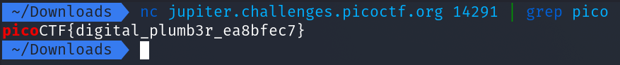
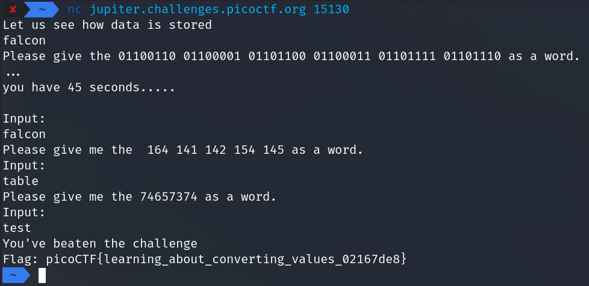
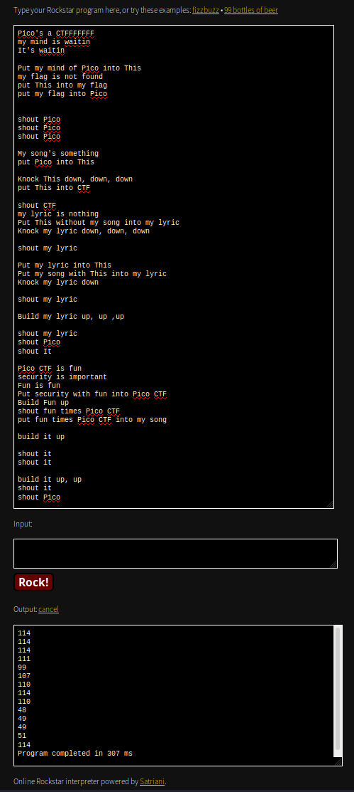
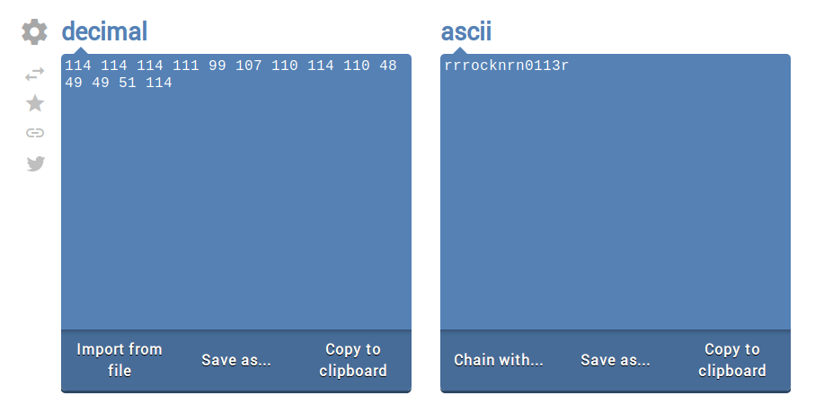
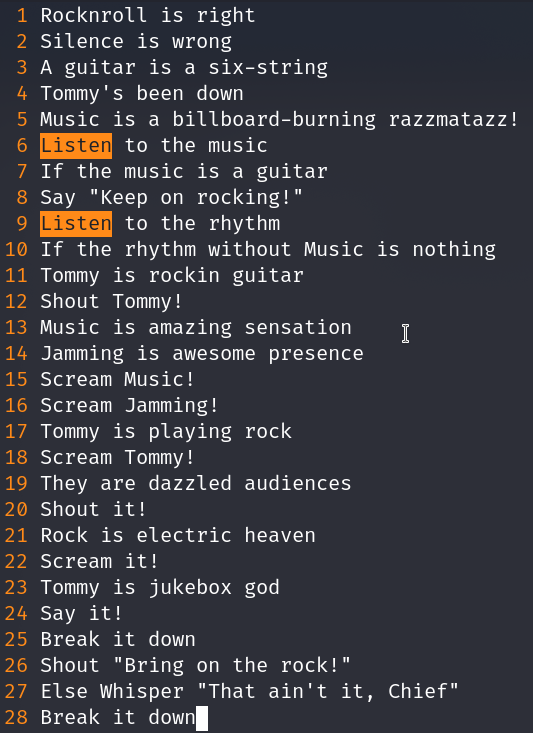
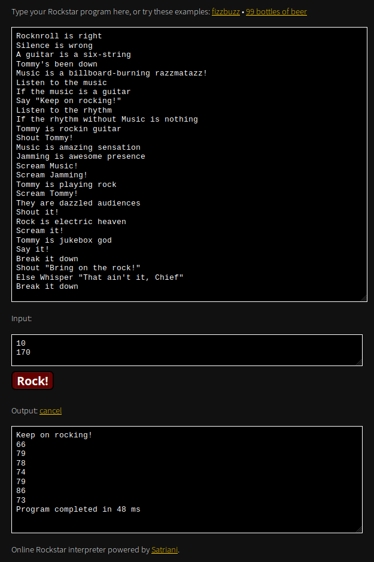
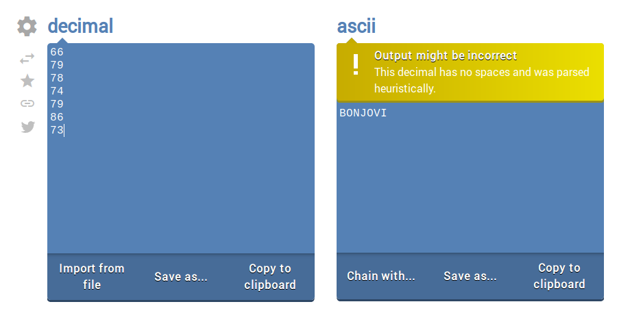

# General Skills

## 2WARM - 50 Points

To convert base 10 values to base 2 in bash, simply use the command:

```bash
$ echo "obase=2;42" | bc
```

The flag for this challenge is `picoCTF{101010}`

## Warmed Up - 50 Points

To convert hex values to decimal, simply use the command:

```bash
$ printf "%d\n" $((16#3d))
```

The flag for this challenge is `picoCTF{61}`

## Lets Warm Up - 50 Points

To convert hex values to ASCII, simply use the command:

```bash
$ echo -n "0x70" | xxd -r && echo ""
```

The flag for this challenge is `picoCTF{p}`

## strings it - 100 Points

As the name suggests, we have to use the `strings` command to find the flag in this file. However, there are a lot of strings, so we should use `grep` to filter the output to what we need. We can filter for `pico`.


The flag for this challenge is `picoCTF{5tRIng5_1T_d66c7bb7}`

## Bases - 100 Points

In this challenge, the text given to use is base64 encoded. To decode this, we can use this simple bash command:

```bash
$ echo "bDNhcm5fdGgzX3IwcDM1" | base64 -d
```

The flag for this challenge is `picoCTF{l3arn_th3_r0p35}`

## First Grep - 100 Points

To find the flag in the given file *quickly*, we have to use `grep` as we did in the `Strings It` challenge. Simply `cat` the file, and use `grep` to filter out for lines that contain the text `pico`.


The flag for this challenge is `picoCTF{grep_is_good_to_find_things_f77e0797}`

## what's a net cat? - 100 Points

For this challenge, we need to use `netcat` on the given URL and port. A tutorial is given on the challenge itself on how to use netcat.


The flag for this challenge is `picoCTF{nEtCat_Mast3ry_d0c64587}`

## plumbing - 200 Points

For this challenge, we have to connect to the given URL and port using `netcat`, as well as filter through the output using `grep` to find the flag.



The flag for this challenge is `picoCTF{digital_plumb3r_ea8bfec7}`

## Based - 200 Points

For this challenge, it is recommended to have multiple websites open that can convert binary, hex, and octal values quickly. When connection to the given URL and port using `netcat`, it will ask you to convert a binary value to ASCII within 45 seconds. After that, it asks you to convert an Octal value to ASCII. Finally, it will ask you to convert a hexadecimal value to ASCII. I would recommend using these two websites for the conversions:
- [Binary/Hex](https://www.rapidtables.com/convert/number/ascii-hex-bin-dec-converter.html)
- [Octal](http://www.unit-conversion.info/texttools/octal/)



The flag for this challenge is `picoCTF{learning_about_converting_values_02167de8}`

## flag_shop - 300 Points

In this challenge, we are both given the URL and Port for where the challenge is, as well as the source code for the script that runs when we connect to that given socket.

Once we connect to the given socket using netcat, we are given an interactive menu that allows us to check our balance, **buy flags**, and exit.

The first thing we should do is look at the source code and look for any places where we can exploit the following code. 

```C++
 24         else if(menu == 2){
 25             printf("Currently for sale\n");
 26             printf("1. Defintely not the flag Flag\n");
 27             printf("2. 1337 Flag\n");
 28             int auction_choice;
 29             fflush(stdin);
 30             scanf("%d", &auction_choice);
 31             if(auction_choice == 1){
 32                 printf("These knockoff Flags cost 900 each, enter desired quantity\n");
 33 
 34                 int number_flags = 0;
 35                 fflush(stdin);
 36                 scanf("%d", &number_flags);
 37                 if(number_flags > 0){
 38                     int total_cost = 0;
 39                     total_cost = 900*number_flags;
 40                     printf("\nThe final cost is: %d\n", total_cost);
 41                     if(total_cost <= account_balance){
 42                         account_balance = account_balance - total_cost;
 43                         printf("\nYour current balance after transaction: %d\n\n", account_balance);
 44                     }
 45                     else{
 46                         printf("Not enough funds to complete purchase\n");
 47                     }
 48 
 49 
 50                 }
```

If we look at line 38, we can see an integer `total_cost` being initialized with a default value of 0. By default this integer is initialized as a 4 byte signed integer, which means it has a max value of `2,147,483,647`, any number higher than that will result in the integer becoming its lowest possible number, which is `-2,147,483,647`. If we supply a big enough number and result in `total_cost` becoming negative, line 42 will end up giving us money (instead of subtracting it), and the goal is to get enough money to buy the flag.


Once we have enough funds, we can buy the flag.


The flag for this challenge is `picoCTF{m0n3y_bag5_68d16363}`

## mus1c

For this challenge, we are given a `txt` file with an obscure code written inside it. Looking at the hints, we can determine that the code in this file is written in programming language called Rockstar. 

You can decode the file using [this website](https://codewithrockstar.com/online).



Once you decode the file, you will be given a few numbers. Decode those numbers from Decimal to ASCII, and you will get the flag.



The flag for this challenge is `picoCTF{rrrocknrn0113r}`

## 1_wanna_b3_a_r0ck5tar - 350 Points

In this challenge, we are given another script written in [rockstar](https://github.com/RockstarLang/rockstar/blob/master/spec.md). If we read the documentation, we can understand this script better reverse it. We can run the script using [this website](https://codewithrockstar.com/online).

In the script, we see lines 6 and 9 ask for input when running the script.



Following the input requests, we see if statements that check our input. To get the rest of the script to run, we need to make sure our first input has to match the value of `a guitar`, which would be `10` if we refer to line 3. 

For the second input, line 10 checks to see if our second input minus `Music` is zero. In this case, we just need to provide our second input as the value of `Music`, which is `170` if you refer to line 5. 

Entering these inputs gives us a few decimal numbers.



If we convert these decimal numbers in ASCII, we get the flag.



The flag for this challenge is `picoCTF{BONJOVI}`
