# Web Exploitation

## Insp3ct0r - 50 Points

To find the flag in this challenge, you have to look in 3 separate places within the webpage inspector in your browser. To open the inspector, press `F12`. 

The first part flag should be in the HTML source code of the web page as a comment.

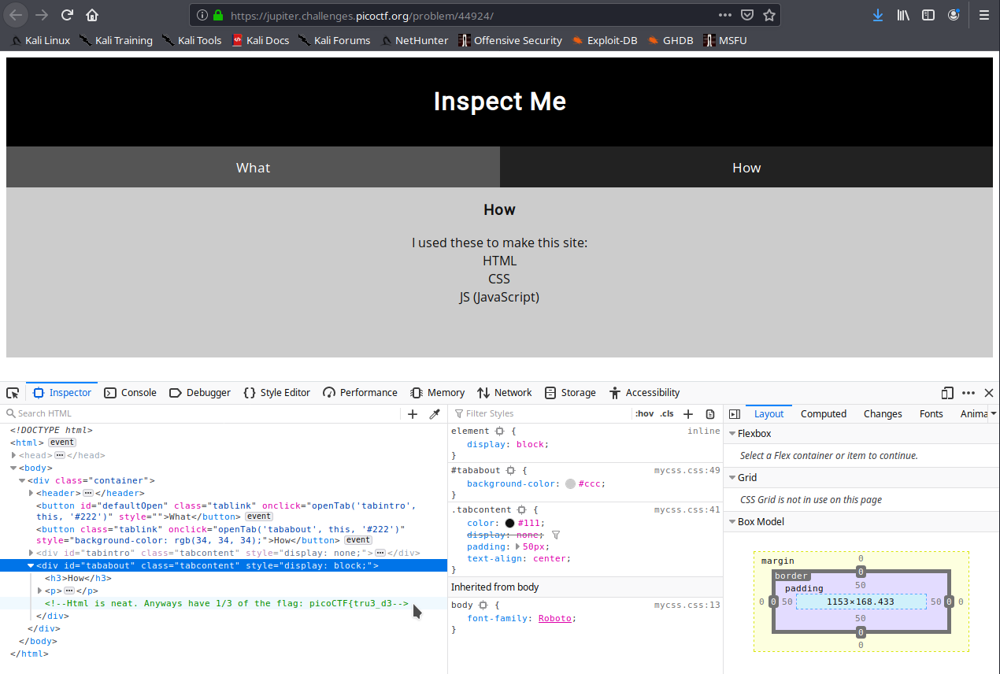

The second part of the flag should be in a comment within the CSS source code belonging to a script in this web page.

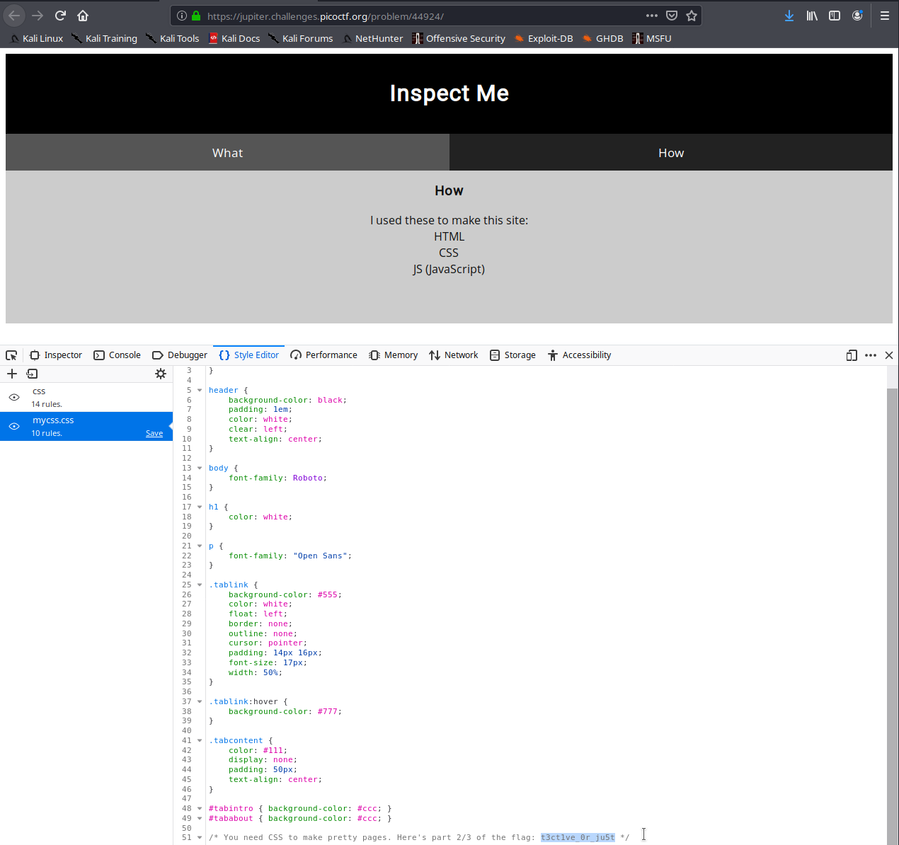

The third part of the flag should be in a comment within the Javascript source code belonging to a script in this web page. 

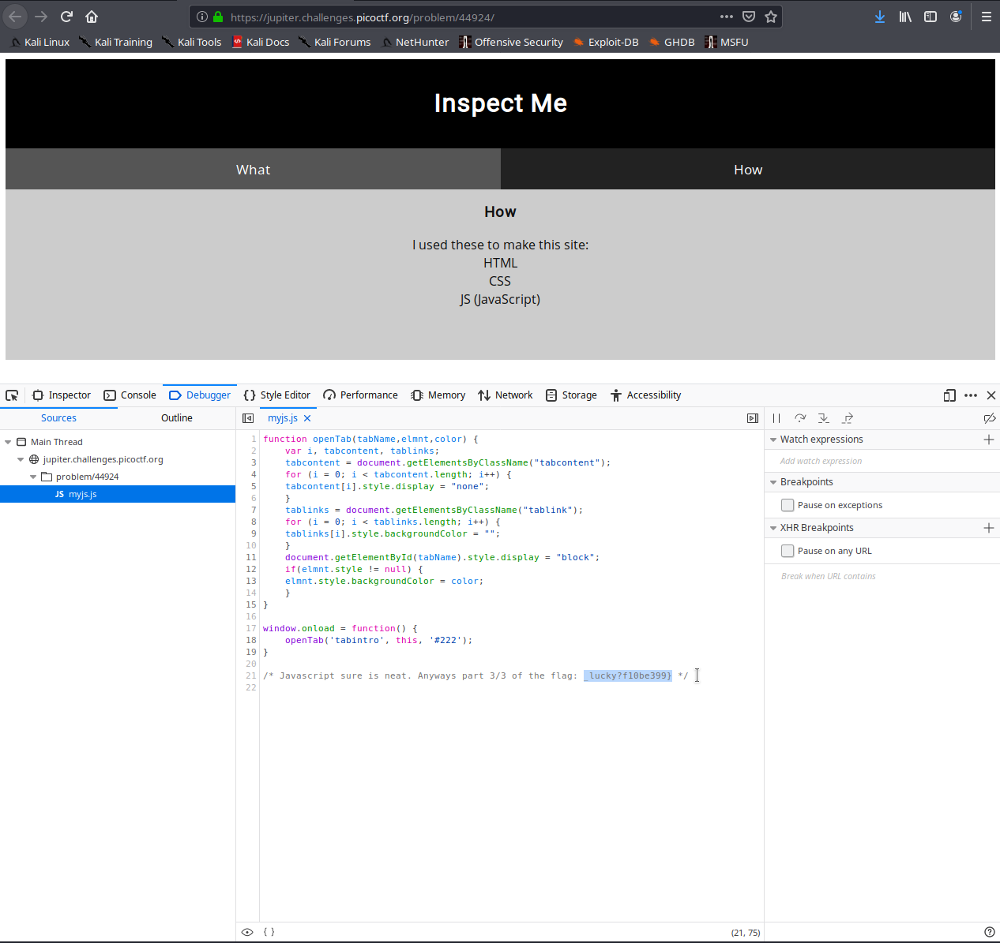

The flag for this challenge is `picoCTF{tru3_d3t3ct1ve_0r_ju5t_lucky?f10be399}`

## where are the robots - 100 Points

This challenge hints at us checking the `robots.txt` file belonging to this website. You can read about it [here](https://support.google.com/webmasters/answer/6062608?hl=en). 

Simply go to `https://jupiter.challenges.picoctf.org/problem/60915/robots.txt`, and you will see one disallowed file.


Going to this file, you will find the flag.


The flag for this challenge is `picoCTF{ca1cu1at1ng_Mach1n3s_8028f}`

## dont-use-client-side - 100 Points

In this challenge, we are presented with a password check. Looking at the source code, we see the password hidden in plain sight (and some lightly obfuscated Javascript).

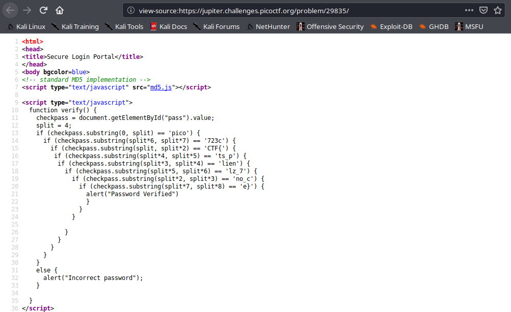

An easy way to clarify this would be concatenate the result of each `if` statement based on the number sequence in its substring arguments. For example, the first string would be in line 13 (since the string splits by 0 and 1), then it would be line 15 (sstring splits by 1 and 2), then line 19 (string splits by 2 and 3), and so on.

The flag for this challenge is `picoCTF{no_clients_plz_7723ce}`

## logon - 100 Points

This challenge gives us a logon page. It will take any sort of credentials and log you in successfully, however you won't be able to see any flags.

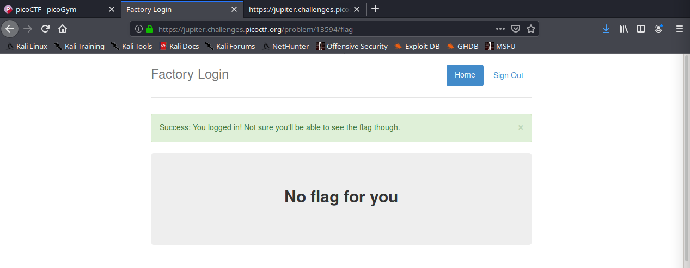

To see the flag, we'll have to open up the inspector and take a look at the cookies. Seeing the cookies, we see a cookie named "admin", with a boolean value. If we flip this value and refresh the page, we'll be able to see the flag. 

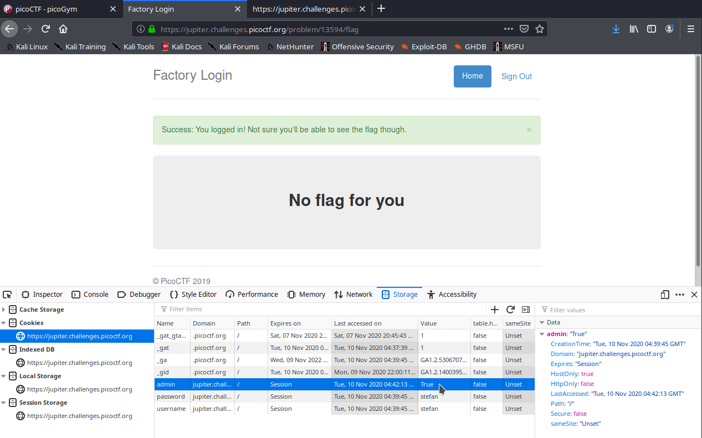

The flag for this challenge is `picoCTF{th3_c0nsp1r4cy_l1v3s_d1c24fef}`

## Client-side-again - 200 Points

This challenge is similar to `dont-use-client-side`, where we are given a login portal with the password being obfuscated in the Javascript code in the web page. We can see the entire JS script in line 10 of the source code.

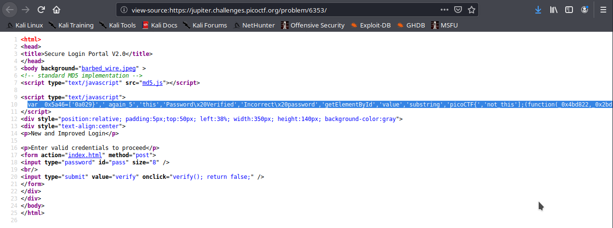

It is always good practice to put heavily obfuscated JS code into a [JS Beautifier](http://www.jsnice.org/) in order to see the code more clearly. After beautifying, copy the code into an text processor or IDE to start de-obfuscating the code and finding the flag. 

```javascript
'use strict';
/** @type {!Array} */
var _0x5a46 = ["0a029}", "_again_5", "this", "Password Verified", "Incorrect password", "getElementById", "value", "substring", "picoCTF{", "not_this"];
(function(data, i) {
  /**
   * @param {number} isLE
   * @return {undefined}
   */
  var write = function(isLE) {
    for (; --isLE;) {
      data["push"](data["shift"]());
    }
  };
  write(++i);
})(_0x5a46, 435);
/**
 * @param {string} level
 * @param {?} ai_test
 * @return {?}
 */
var _0x4b5b = function(level, ai_test) {
  /** @type {number} */
  level = level - 0;
  var rowsOfColumns = _0x5a46[level];
  return rowsOfColumns;
};
/**
 * @return {undefined}
 */
function verify() {
  checkpass = document[_0x4b5b("0x0")]("pass")[_0x4b5b("0x1")];
  /** @type {number} */
  split = 4;
  if (checkpass[_0x4b5b("0x2")](0, split * 2) == _0x4b5b("0x3")) {
    if (checkpass[_0x4b5b("0x2")](7, 9) == "{n") {
      if (checkpass[_0x4b5b("0x2")](split * 2, split * 2 * 2) == _0x4b5b("0x4")) {
        if (checkpass[_0x4b5b("0x2")](3, 6) == "oCT") {
          if (checkpass[_0x4b5b("0x2")](split * 3 * 2, split * 4 * 2) == _0x4b5b("0x5")) {
            if (checkpass["substring"](6, 11) == "F{not") {
              if (checkpass[_0x4b5b("0x2")](split * 2 * 2, split * 3 * 2) == _0x4b5b("0x6")) {
                if (checkpass[_0x4b5b("0x2")](12, 16) == _0x4b5b("0x7")) {
                  alert(_0x4b5b("0x8"));
                }
              }
            }
          }
        }
      }
    }
  } else {
    alert(_0x4b5b("0x9"));
  }
}
;
```

The first thing we see is an array being initialized on line 3 named `0x5a46`, which holds 10 strings. This array seems promising as it holds fragments of the flag, such as `picoCTF{`. 

The next thing we should look at is the function `verify()` on line 30. This function seems to match substrings within our provided password to obscure values that function `_0x4b5b` returns. We can determined what values that function returns by testing each hex value from 0 to 9 by using the debug console in the browser, and then replacing the function call with the returned value for easier readability. You can also replace `split` with `4`, and combine all the arithmetic. 

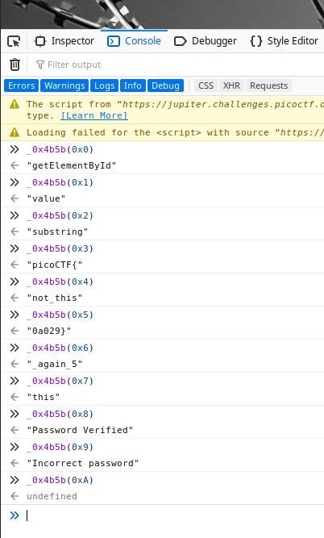

|Find|Replace|
|---|---|
|`0x0`|`getElementById`|
|`0x1`|`value`|
|`0x2`|`substring`|
|`0x3`|`picoCTF{`|
|`0x4`|`not_this`|
|`0x5`|`0a029}`|
|`0x6`|`_again_5`|
|`0x7`|`this`|
|`0x8`|`Password Verified`|
|`0x9`|`Incorrect Password`|
|`split`|`4`|

After replacing all the values, your function `verify()` should look something like this:

```javascript
function verify() {
  checkpass = document[getElementById]("pass")[value];
  /** @type {number} */
  4 = 4;
  if (checkpass[substring](0, 8) == "picoCTF{") {
    if (checkpass[substring](7, 9) == "{n") {
      if (checkpass[substring](8, 16) == "not_this") {
        if (checkpass[substring](3, 6) == "oCT") {
          if (checkpass[substring](24, 32) == "0a029") {
            if (checkpass[substring](6, 11) == "F{not") {
              if (checkpass[substring](16, 24) == "_again_5") {
                if (checkpass[substring](12, 16) == "this") {
                  alert("Password Verified");
                }
              }
            }
          }
        }
      }
    }
  } else {
    alert("Incorrect Password");
  }
```

Now the flag is hiding in plain sight. Just like with the previous client side challenge, combine the strings from each `if` statement based on their index.

The flag for this challenge is `picoCTF{not_this_again_50a029}`

## Open-to-admins - 200 Points

In this challenge, we need to get the flag while being **admin**, and have the **time** be **1400**. To do this, simply add two cookies: one cookie named `time`, with the value set to `1400`, and another cookie named `admin`, with the value being set to `True`. Once this is done, click the flag button and it will show up. 

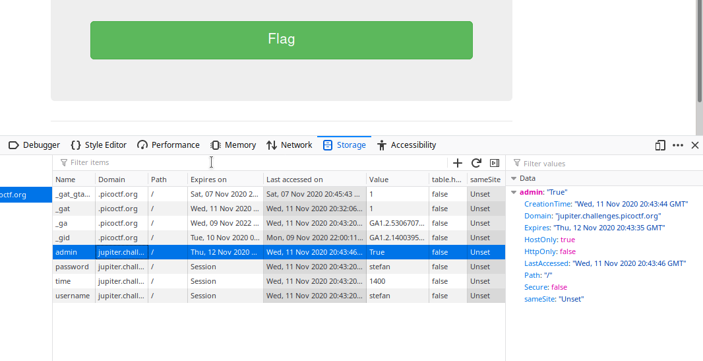

The flag for this challenge is `picoCTF{0p3n_t0_adm1n5_fa4905c1}`

## picobrowser - 200 Points

This challenge requires us to use **picobrowser** to see the flag. If we try getting the flag with any other browser, this error message pops up, telling us we're not using picobrowser.

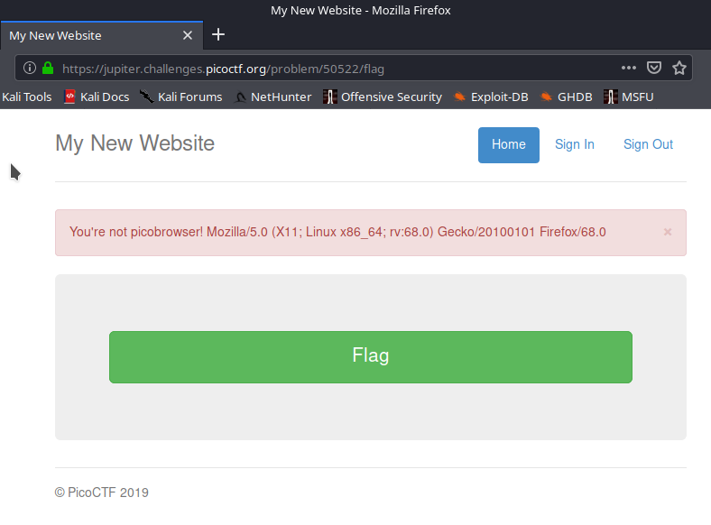

We can fool the web page by changing our [User-Agent](https://en.wikipedia.org/wiki/User_agent) to something that resembles picobrowser. We can do this easily using `curl`.

```bash
$ curl -s --user-agent "picobrowser" https://jupiter.challenges.picoctf.org/problem/50522/flag | grep picoCTF 
```

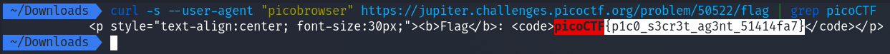

The flag for this challenge is `picoCTF{p1c0_s3cr3t_ag3nt_51414fa7}`
