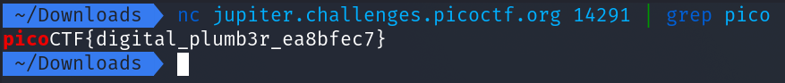
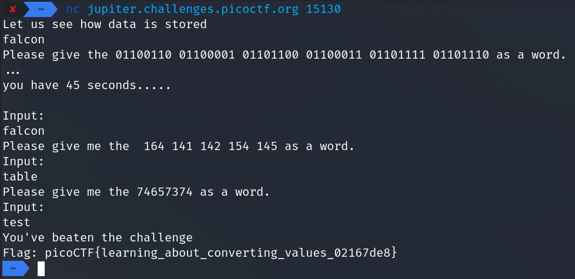

# General Skills

## 2WARM - 50 Points

To convert base 10 values to base 2 in bash, simply use the command:

```bash
$ echo "obase=2;42" | bc
```

The flag for this challenge is `picoCTF{101010}`

## Warmed Up - 50 Points

To convert hex values to decimal, simply use the command:

```bash
$ printf "%d\n" $((16#3d))
```

The flag for this challenge is `picoCTF{61}`

## Lets Warm Up - 50 Points

To convert hex values to ASCII, simply use the command:

```bash
$ echo -n "0x70" | xxd -r && echo ""
```

The flag for this challenge is `picoCTF{p}`

## strings it - 100 Points

As the name suggests, we have to use the `strings` command to find the flag in this file. However, there are a lot of strings, so we should use `grep` to filter the output to what we need. We can filter for `pico`.


The flag for this challenge is `picoCTF{5tRIng5_1T_d66c7bb7}`

## Bases - 100 Points

In this challenge, the text given to use is base64 encoded. To decode this, we can use this simple bash command:

```bash
$ echo "bDNhcm5fdGgzX3IwcDM1" | base64 -d
```

The flag for this challenge is `picoCTF{l3arn_th3_r0p35}`

## First Grep - 100 Points

To find the flag in the given file *quickly*, we have to use `grep` as we did in the `Strings It` challenge. Simply `cat` the file, and use `grep` to filter out for lines that contain the text `pico`.


The flag for this challenge is `picoCTF{grep_is_good_to_find_things_f77e0797}`

## what's a net cat? - 100 Points

For this challenge, we need to use `netcat` on the given URL and port. A tutorial is given on the challenge itself on how to use netcat.


The flag for this challenge is `picoCTF{nEtCat_Mast3ry_d0c64587}`

## plumbing - 200 Points

For this challenge, we have to connect to the given URL and port using `netcat`, as well as filter through the output using `grep` to find the flag.



The flag for this challenge is `picoCTF{digital_plumb3r_ea8bfec7}`

## Based - 200 Points

For this challenge, it is recommended to have multiple websites open that can convert binary, hex, and octal values quickly. When connection to the given URL and port using `netcat`, it will ask you to convert a binary value to ASCII within 45 seconds. After that, it asks you to convert an Octal value to ASCII. Finally, it will ask you to convert a hexadecimal value to ASCII. I would recommend using these two websites for the conversions:
- [Binary/Hex](https://www.rapidtables.com/convert/number/ascii-hex-bin-dec-converter.html)
- [Octal](http://www.unit-conversion.info/texttools/octal/)



The flag for this challenge is `picoCTF{learning_about_converting_values_02167de8}`


